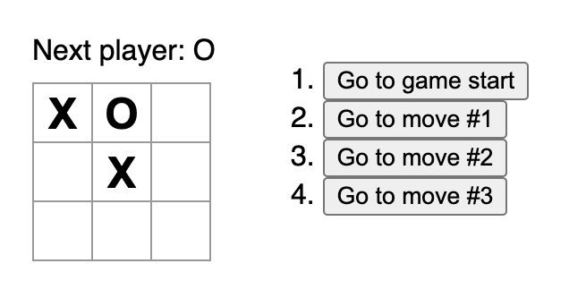

# Vanilla Tic-Tac-Toe

A vanilla JavaScript port of the [Tic-Tac-Toe example](https://react.dev/learn/tutorial-tic-tac-toe) from the Learn React tutorial.

To learn more about vanilla web development, feel free to explore this tutorial: https://plainvanillaweb.com

## Kicking the tires

Run the `vanilla/` folder as a static website, and browse to it:

- node: `npx http-server vanilla -c-1`
- php: `php -S localhost:8000 -t vanilla`
- python: `python3 -m http.server 8000 --directory vanilla`

You should see this game:

 
 